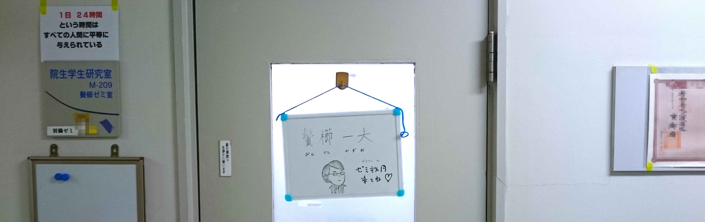

 

## ニュース

今日も平和です。

## 研究指針

両眼視を始めとした基礎研究をしています。立体視や視野闘争。
音楽活動を通して、メロディやリズムなどに対する人間の知覚特性の研究にも挑戦中です。

研究方略としては、まず立体視や仮現運動など大きな効果の現象を見出し、どのような操作によって効果量が減少するかを考えます。この手続きから、知覚処理責任はいずれにあるのか、その責任所在にはどのような特性があるかなどを考察します。
